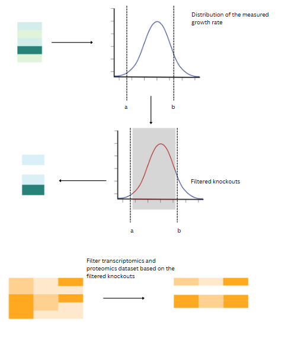

This folder contains the code to generate the data splits. Additionally, the CSV files containing the IDs for each split has been included.

The **percentile_splits.ipynb** file uses the transcriptomics/proteomics measurements and measured growth rates from the **data** file to split the data into low and high growth rates.

